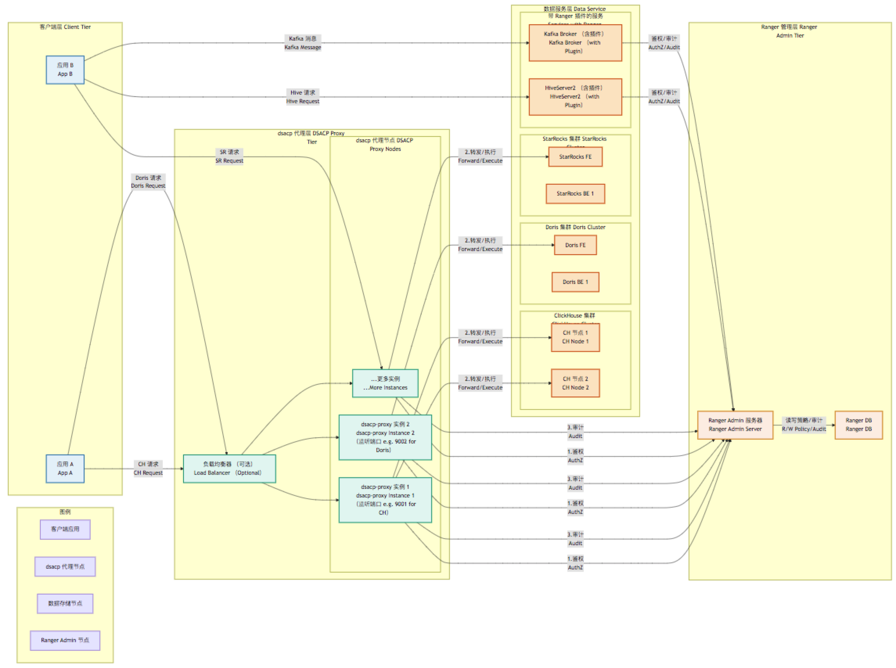

# dsacp: 统一数据安全访问控制平台 (Unified Data Security Access Control Platform)

`dsacp` 是一个开源项目，旨在为大数据生态中的多种异构数据存储（如 Pulsar, Kafka, Hive, HDFS, ClickHouse, Doris, StarRocks 等）提供一个基于 Apache Ranger 的统一敏感信息安全访问控制解决方案。它通过实现高性能的代理层和适配器，将 Apache Ranger 的细粒度权限管理、动态数据脱敏和集中审计能力扩展到原生不支持 Ranger 的数据系统中。

---

## 项目背景 (Project Background)

在现代企业中，数据呈现爆炸式增长，并且通常存储在多种不同技术栈的数据存储系统中。确保这些异构系统中的敏感数据在采集、存储、处理和访问全生命周期中的安全性，同时满足日益严格的合规性要求（如 GDPR, CCPA, 等保），是一项复杂且至关重要的挑战。

**主要痛点 (Key Pain Points):**

* **异构系统管理复杂 (Complexity in Managing Heterogeneous Systems)**: 不同数据存储拥有独立的、不一致的权限管理机制。
* **缺乏统一视图 (Lack of Unified View)**: 难以从全局视角审计和监控数据访问行为。
* **细粒度控制不足 (Insufficient Fine-Grained Control)**: 许多系统原生不支持列级别权限、行级别过滤或动态数据脱敏。
* **集成挑战 (Integration Challenges)**: 像 ClickHouse, Doris, StarRocks 这样的 OLAP 系统通常缺乏与 Apache Ranger 等主流安全框架的直接集成。

`dsacp` 项目致力于解决这些痛点，提供一个统一、高效且易于扩展的数据安全访问控制层。

## `dsacp` 解决方案 (The `dsacp` Solution)

`dsacp` 以 **Apache Ranger** 作为统一的策略管理和审计中心。

* 对于 **原生支持 Ranger 插件** 的系统 (如 HDFS, Hive, Kafka, Pulsar)，`dsacp` 可以与之协同工作，并可选择性地提供增强功能或统一的配置管理入口。
* 对于 **缺乏原生 Ranger 插件** 的系统 (特别是 ClickHouse, Doris, StarRocks)，`dsacp` 的核心组件 **`dsacp-proxy`** 将作为这些数据源的强制访问点 (Choke Point)。所有数据访问请求都将通过 `dsacp-proxy`，代理会负责：
    1.  **解析请求 (Parse Request)**: 理解查询语义，提取用户、操作和资源信息。
    2.  **策略查询与执行 (Policy Fetch & Enforcement)**: 与 Ranger Admin 通信，获取相关策略（支持本地缓存），并根据策略决定允许、拒绝或修改（如脱敏）请求。
    3.  **数据脱敏 (Data Masking)**: 根据 Ranger 策略动态修改查询结果中的敏感数据。
    4.  **审计日志 (Audit Logging)**: 将所有访问尝试和策略执行结果上报给 Ranger进行集中审计。

通过这种方式，`dsacp` 将 Apache Ranger 的强大功能扩展到了更广泛的数据生态系统。

## 核心特性 (Core Features)

* **统一访问控制 (Unified Access Control)**: 基于 Apache Ranger 实现对多数据源的集中式策略管理。
* **细粒度授权 (Fine-Grained Authorization)**: 支持库、表、列、消息主题等资源的精细权限控制。
* **动态数据脱敏 (Dynamic Data Masking)**: 在查询结果返回前，根据策略对敏感字段进行实时脱敏，原始数据保持不变。
* **集中审计 (Centralized Auditing)**: 所有数据访问行为和策略执行记录统一发送到 Ranger Audit Store。
* **高性能代理 (High-Performance Proxy)**: `dsacp-proxy` 基于 Golang 实现，注重低延迟和高并发处理能力。
* **可扩展架构 (Extensible Architecture)**: 易于添加对新数据源的支持。
* **Doris, StarRocks, ClickHouse 支持 (Doris, StarRocks, ClickHouse Support)**: 为这些流行的 OLAP 数据库提供与 Ranger 集成的关键能力。
* **相对业务无感知 (Relatively Transparent to Business)**: 尽量减少对现有应用代码的修改，主要通过更改连接配置接入。

## 支持的数据存储 (Supported Data Stores)

`dsacp` 旨在支持以下数据存储（部分通过原生 Ranger 插件，部分通过 `dsacp-proxy`）：

* **通过 `dsacp-proxy` (主要目标)**
    * ClickHouse
    * Apache Doris
    * StarRocks
* **通过 Ranger 原生插件 (协同工作)**
    * Apache Hive
    * Apache Kafka
    * Apache HDFS
    * Apache Pulsar
    * Apache HBase
    * (以及其他支持 Ranger 的组件)

## 架构概览 (Architecture Overview)

`dsacp` 的核心组件包括：

* **`dsacp-proxy`**: 一个或多个高性能 Golang 代理实例，负责拦截、解析、鉴权、脱敏和审计对目标数据源（如 ClickHouse, Doris, StarRocks）的访问。
* **Apache Ranger Admin & DB**: 策略定义、存储和审计日志的中心。
* **Ranger Plugins**: 用于 HDFS, Hive, Kafka, Pulsar 等系统的原生插件。

  更详细的架构设计请参见 [**详细架构文档 (Detailed Architecture Document)**](docs/architecture.md)。

## 快速开始 (Getting Started)

### 先决条件 (Prerequisites)

1.  **Apache Ranger**: 已安装并运行 Apache Ranger Admin (建议 2.x 或更高版本)。
2.  **Golang**: 版本 1.20.2 或更高 (用于编译 `dsacp`)。
3.  **目标数据源**: 已部署并运行您希望通过 `dsacp` 保护的数据存储 (如 ClickHouse, Doris, StarRocks)。
4.  **(可选) Docker**: 用于容器化部署。

### 安装 (Installation)

#### 1. 从源码编译 (Build from Source)

```bash
git clone [https://github.com/turtacn/dsacp.git](https://github.com/turtacn/dsacp.git)
cd dsacp
./scripts/build.sh
````

编译后的 `dsacp-proxy` 可执行文件将位于 `bin/` 目录下。

#### 2\. 使用 Docker (Using Docker) (待提供 Dockerfile 后)

```bash
# docker pull turtacn/dsacp:latest # (示例)
# docker run ...
```

### 配置 (Configuration)

`dsacp-proxy` 的行为通过 YAML 配置文件进行控制 (例如 `configs/dsacp-proxy.yaml.example`)。

关键配置项包括：

  * **Ranger 服务器地址 (Ranger Server Address)**:
    ```yaml
    ranger:
      url: "http://your-ranger-admin-host:6080"
      username: "ranger_admin_user" # 用于从Ranger拉取策略的用户
      password: "ranger_admin_password"
      serviceNamePrefix: "dsacp_" # Ranger中对应服务的名称前缀
      pollIntervalSec: 30
      policyCacheDir: "/tmp/dsacp/policycache"
    ```
  * **代理监听地址和目标数据源 (Proxy Listen Address and Target Data Source)**:
    ```yaml
    proxy:
      # ClickHouse 代理示例
      clickhouse:
        enabled: true
        listenAddr: ":9001" # dsacp-proxy 监听的地址
        targetAddr: "your-clickhouse-server:8123" # 实际 ClickHouse HTTP 服务地址
        protocol: "http" # 或 native
        rangerServiceName: "dsacp_clickhouse_service_dev" # 在Ranger中为此CH实例创建的服务名
        defaultUser: "default" # 如果客户端未提供用户，使用的默认用户

      # Doris 代理示例 (通常通过 MySQL 协议)
      doris:
        enabled: true
        listenAddr: ":9031" # dsacp-proxy 监听的地址
        targetAddr: "your-doris-fe-server:9030" # 实际 Doris FE MySQL 端口
        protocol: "mysql"
        rangerServiceName: "dsacp_doris_service_prod"
        defaultUser: "default"

      # StarRocks 代理示例 (通常通过 MySQL 协议)
      starrocks:
        enabled: true
        listenAddr: ":9032"
        targetAddr: "your-starrocks-fe-server:9030"
        protocol: "mysql"
        rangerServiceName: "dsacp_starrocks_service_qa"
        defaultUser: "default"
    ```
  * **日志配置 (Logging Configuration)**:
    ```yaml
    logger:
      level: "info" # debug, info, warn, error
      format: "json" # text, json
      output: "stdout" # stdout, stderr, or file path
    ```

### 运行 `dsacp-proxy` (Running `dsacp-proxy`)

```bash
./bin/dsacp-proxy --config /path/to/your/dsacp-proxy.yaml
```

## 使用 `dsacp` (Using `dsacp`)

1.  **在 Apache Ranger 中定义服务 (Define Services in Apache Ranger)**:

      * 为每个需要通过 `dsacp-proxy` 管理的数据源实例 (如一个 ClickHouse 集群，一个 Doris 集群) 在 Ranger Admin 中创建一个新的服务。服务名称应与 `dsacp-proxy` 配置文件中的 `rangerServiceName` 匹配。
      * 服务类型通常为 `tag` (如果主要使用基于标签的策略) 或者可以为特定的代理目标自定义服务类型定义（如果需要更精细的资源匹配，例如数据库、表、列）。对于 `dsacp`，可以创建一个通用的 `dsacp-proxied-service` 类型。

2.  **在 Ranger 中定义策略 (Define Policies in Ranger)**:

      * 为创建的服务定义访问控制策略和脱敏策略。
      * 例如，允许用户 `Alice` 查询 `ClickHouse` 服务中 `sales_db.orders_table` 表的 `order_id` 和 `amount` 列，但对 `customer_name` 列应用 `MASK_SHOW_LAST_4` 脱敏规则。

3.  **配置应用 (Configure Applications)**:

      * 修改您的业务应用，将其连接目标从原始数据源地址指向 `dsacp-proxy` 的监听地址和端口。
      * 确保应用连接时使用的用户名能够在 Ranger 中被识别并授予相应权限。

4.  **监控与审计 (Monitor and Audit)**:

      * 在 Ranger Admin 的审计界面查看通过 `dsacp-proxy` 的所有数据访问日志和策略执行情况。
      * 监控 `dsacp-proxy` 的日志和性能指标。

## 构建 (Building)

```bash
# 克隆仓库
git clone [https://github.com/turtacn/dsacp.git](https://github.com/turtacn/dsacp.git)
cd dsacp

# 安装依赖
go mod tidy
go mod vendor # 可选

# 编译
# 默认编译所有 cmd 下的 main 包
./scripts/build.sh

# 或者手动编译指定目标
# go build -o ./bin/dsacp-proxy ./cmd/dsacp-proxy
```

## 贡献 (Contributing)

我们欢迎任何形式的贡献！无论是 Bug 修复、功能增强、文档改进还是测试用例。

请遵循以下步骤：

1.  Fork 本仓库。
2.  创建一个新的分支 (`git checkout -b feature/YourFeature` 或 `bugfix/YourBugfix`)。
3.  进行修改并提交 (`git commit -m 'Add some feature'`)。
4.  将您的分支推送到 GitHub (`git push origin feature/YourFeature`)。
5.  创建一个 Pull Request。

请确保您的代码符合项目编码规范 (待定义)并通过所有测试。

## 开源许可证 (License)

`dsacp` 项目采用 [Apache License 2.0](https://www.google.com/search?q=LICENSE) 开源许可证。

## 未来展望 (Future Roadmap) - 待定

  * 支持更多数据源的代理。
  * 更高级的 SQL 解析能力。
  * 支持原生 TCP 协议代理 (如 ClickHouse Native Protocol)。
  * 与 OpenTelemetry 等可观测性框架集成。
  * Web UI 管理界面 (用于 `dsacp-proxy` 配置和状态监控)。
  * 行级别过滤支持。

## 联系我们 (Contact Us)

  * 如果您遇到问题或有任何建议，请提交 [GitHub Issues](https://www.google.com/search?q=https://github.com/turtacn/dsacp/issues)。