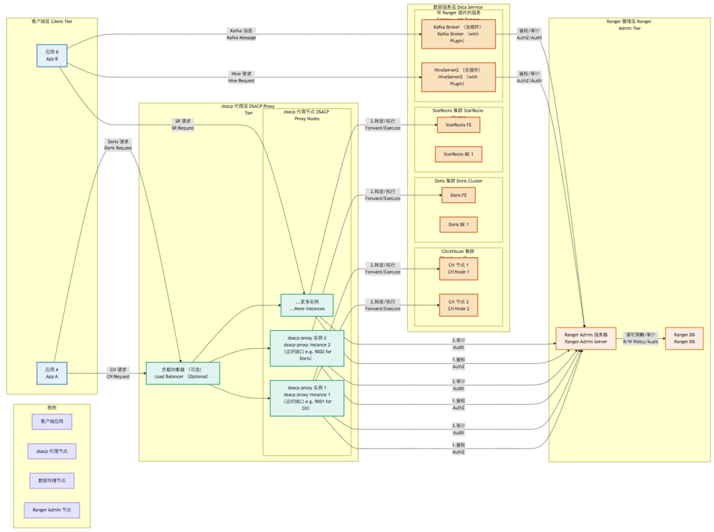

# dsacp: 统一数据安全访问控制解决方案架构文档

## 1\. 引言

`dsacp` (Data Security Access Control Proxy/Platform) 是一个旨在为大数据生态中的多种数据存储（包括 Pulsar, ClickHouse, Doris, StarRocks, HDFS, Kafka, Hive 等）提供统一敏感信息安全访问控制的开源项目。本项目以 Apache Ranger 为核心策略管理和审计引擎，通过构建代理层、适配层和必要的辅助工具，实现细粒度的权限控制、动态数据脱敏和集中的安全审计。

项目的目标是提供一个可插拔、易于扩展、对业务影响小的安全增强层，帮助企业在复杂的数据环境中有效保护敏感数据，满足合规性要求。项目地址：[https://github.com/turtacn/dsacp](https://github.com/turtacn/dsacp)

## 2\. 背景与挑战

在大数据环境下，企业通常会混合使用多种数据存储和处理技术。确保这些异构系统中的敏感数据在整个生命周期（从采集、存储到访问）的安全性，同时满足合规性要求，是一项严峻的挑战。

  * **异构系统管理复杂**：不同数据存储拥有各自的权限管理机制，策略难以统一，管理成本高。
  * **原生支持有限**：部分系统如 ClickHouse、Doris、StarRocks 等缺乏与 Apache Ranger 的原生集成。
  * **细粒度控制缺失**：许多场景需要字段级别的访问控制和动态脱敏，原生系统支持不足。
  * **审计能力分散**：安全审计日志分散在各个系统中，难以进行统一分析和监控。

本方案提出以 Apache Ranger 为核心，结合针对性的代理和适配器，构建 `dsacp` 解决方案，以应对上述挑战。

## 3\. 实践对比与多维度分析

在实施数据安全方案时，不同的策略选择会在实施工作量、预期效果和潜在缺陷上存在显著差异。下表从多个维度对比了不同安全级别的实践方案，并加入了对 Doris 和 StarRocks 的考量：

| 维度             | 无控制 (No Control)                                 | 原生数据库控制 (Native DB Control)                    | Ranger 原生方案 (Ranger Native)                                                                 | dsacp (Ranger + 代理/适配器) (Ranger + Proxy/Adapter)                                                                                                                              |
| :--------------- | :-------------------------------------------------- | :---------------------------------------------------- | :---------------------------------------------------------------------------------------------- | :--------------------------------------------------------------------------------------------------------------------------------------------------------------------------------- |
| **整体缺陷** | 安全风险极高                                        | 管理复杂, 策略不一致                                  | ClickHouse, Doris, StarRocks 等非原生支持系统需额外方案                                               | 自定义/代理组件引入新的维护成本和潜在故障点                                                                                                                                |
| **覆盖系统** | Pulsar, ClickHouse, Doris, StarRocks, HDFS, Kafka, Hive | 部分支持 (Specific DBs Only)                          | HDFS, Hive, Kafka, Pulsar, HBase 等                                                               | HDFS, Hive, Kafka, Pulsar, ClickHouse, Doris, StarRocks (通过代理/自定义插件) 等                                                                                                       |
| **整改工作量** | 低                                                  | 中 (各系统独立配置)                                   | 中 (Ranger部署, 插件安装, 策略配置)                                                               | 高 (包含代理开发/部署配置, Ranger部署, 插件安装, 策略配置)                                                                                                                           |
| **业务适配代价** | 无                                                  | 低 (通常应用已有权限逻辑)                             | 中 (需配置服务账户权限, 可能影响现有访问)                                                         | 中-高 (同 Ranger Native, 且代理可能改变访问方式, 如ClickHouse/Doris/StarRocks)                                                                                                      |
| **性能影响** | 无                                                  | 低                                                    | 低-中 (插件引入检查, 缓存可优化)                                                                    | 中 (除插件外, 代理/自定义逻辑增加延迟, 需精心优化)                                                                                                                                   |
| **审计能力** | 无                                                  | 有限                                                  | 全面 (集中审计)                                                                                 | 全面 (需确保代理/自定义部分正确上报至 Ranger)                                                                                                                                      |
| **预期效果** | 差 (风险高)                                         | 一般 (不统一, 有盲点)                                 | 好 (统一策略, 细粒度, 可审计, 覆盖原生支持系统)                                                     | 非常好 (统一策略, 细粒度, 可审计, 覆盖更全面)                                                                                                                                   |
| **开关控制** | 不适用                                              | 部分支持                                              | 支持 (策略可启用/禁用)                                                                          | 支持 (策略可启用/禁用, 代理/自定义可旁路)                                                                                                                                       |
| **控制粒度** | 无                                                  | 库/表级为主                                           | 文件/目录, 主题, 表, 列, 字段                                                                      | 同 Ranger Native，代理/自定义实现粒度可配置 (文件/目录, 主题, 表, 列, 字段)                                                                                                          |
| **管理方式** | 分散                                                | 分散                                                  | 集中化 (Ranger Admin)                                                                           | 集中化 (主要通过 Ranger Admin, 代理配置辅助)                                                                                                                                       |

**分析解读**:

  * **Apache Ranger 原生方案** 在统一管理、细粒度控制和审计方面优势明显，适用于 HDFS, Hive, Kafka, Pulsar 等已有官方插件的系统。
  * 对于 **ClickHouse, Doris, StarRocks** 这类缺乏官方 Ranger 插件的系统，`dsacp` 方案通过引入统一的 **代理层 (dsacp-proxy)** 是实现统一纳管的关键。这能达到最全面的覆盖和统一管理效果，但也增加了整改工作量和潜在的系统复杂性。
  * **原生数据库控制** 方式难以满足现代企业级数据安全需求。
  * **无控制** 状态风险极高，不应考虑。

综合来看，采用以 Apache Ranger 为策略中心，通过 `dsacp` 构建代理和适配器层，是实现对包括 ClickHouse, Doris, StarRocks 在内的异构数据源进行统一安全访问控制的较优实践。

## 4\. dsacp 架构设计

`dsacp` 采用分层设计，以 Apache Ranger 为核心，为不支持 Ranger 原生插件的数据源（如 ClickHouse, Doris, StarRocks）提供代理层，并为支持原生插件的系统提供统一的配置管理和增强能力（如果需要）。

### 4.1 设计原则

  * **统一策略管理**：所有安全策略（访问控制、脱敏）通过 Apache Ranger Admin 集中定义和管理。
  * **最小侵入性**：尽可能减少对现有业务应用和数据存储架构的修改。
  * **细粒度控制**：支持基于用户/组/角色对资源（库、表、列、文件、Topic 等）的精确权限控制和动态数据脱敏。
  * **可扩展性**：易于支持新的数据源和新的安全功能。
  * **高性能**：代理层和适配器设计注重性能优化，减少延迟。
  * **可观测性**：提供完善的日志和监控能力。
  * **可插拔性**：各组件应松耦合，便于独立升级和替换。

### 4.2 逻辑架构

下图描述了整合 Apache Ranger 和 `dsacp` 后的数据安全架构：

**架构解读**:

  * **安全管理层 (Security Management Layer)**:
      * **Ranger Admin**: 提供统一的 Web UI 用于策略管理（访问控制、脱敏、行级过滤、列级权限）和审计查询。所有策略集中存储于 Ranger DB。
      * **UserSync**: 从企业 LDAP/AD 同步用户和组信息到 Ranger Admin，实现基于企业身份的权限管理。
      * **Ranger KMS**: (可选) 管理 HDFS 等使用的加密密钥，并由 Ranger 控制密钥的访问权限。
      * **Ranger DB**: 存储安全策略和审计日志的核心数据库。
  * **dsacp 接入与执行层 (DSACP Access and Enforcement Layer)**:
      * **Ranger 原生插件 (Ranger Native Plugins)**: 直接嵌入在对应数据服务的节点上（如 NameNode, HiveServer2, Kafka Broker, Pulsar Broker）。它们拦截数据访问请求，从 Ranger Admin 拉取并缓存策略，在本地执行鉴权决策，并将审计日志异步发送回 Ranger Admin。`dsacp` 可以与这些原生插件协同工作。
      * **dsacp 代理服务 (dsacp Proxy Services)**: 由于 ClickHouse, Doris, StarRocks 无官方 Ranger 插件，`dsacp` 项目的核心是为这些数据源提供一个或多个高性能代理服务 (`dsacp-proxy`)。
          * 应用通过此代理访问 ClickHouse/Doris/StarRocks。
          * 代理负责解析请求（如 SQL），调用 Ranger Admin 进行鉴权（通过 `dsacp` 内置的 Ranger 客户端模块或直接使用 Ranger REST API）。
          * 执行决策（允许/拒绝/数据修改，如脱敏）。
          * 将访问信息转换为 Ranger 审计格式上报给 Ranger Admin。
          * 这些代理将使用 Golang 实现，以获得高性能和高并发能力。
      * **dsacp 核心服务 (dsacp Core Service)** (可选): 一个轻量级的服务，用于管理和分发 `dsacp-proxy` 的配置，或提供一些集中的辅助功能。初期可以不实现，通过配置文件管理代理。
  * **用户访问层 (User Access Layer)**: 业务应用或最终用户通过标准的客户端或接口访问数据服务。对于需要通过代理访问的数据源 (ClickHouse, Doris, StarRocks)，访问端点需指向对应的 `dsacp-proxy` 地址。
  * **数据存储层 (Data Storage Layer)**: 包含所有受 `dsacp` 和 Ranger 保护的数据存储系统。

### 4.3 部署架构

部署架构强调了 `dsacp-proxy` 作为独立进程与数据源和 Ranger Admin 的交互。

**部署说明**:

  * `dsacp-proxy` 实例可以根据需要水平扩展，并通过负载均衡器对外提供服务。
  * 每个 `dsacp-proxy` 实例可以配置为代理一个或多个数据源，或者为特定数据源启动专用实例（如上图示例，ProxyNode1 代理 ClickHouse，ProxyNode2 代理 Doris）。
  * 对于已支持 Ranger 原生插件的系统 (Hive, Kafka, HDFS, Pulsar)，其插件直接与 Ranger Admin 通信。`dsacp` 主要关注对无原生插件系统的纳管。
  * Ranger Admin 和 Ranger DB 是核心的策略管理和审计组件，需要高可用部署。

### 4.4 核心组件与流程

#### 4.4.1 dsacp-proxy (针对 ClickHouse, Doris, StarRocks)

`dsacp-proxy` 是 `dsacp` 项目的核心组件之一，它是一个用 Golang 编写的高性能网络代理。

  * **协议解析**: 能够理解对应数据源的基本通信协议 (如 ClickHouse HTTP/Native, Doris MySQL, StarRocks MySQL 协议)。对于 SQL 类请求，需要解析 SQL 以提取表名、列名等资源信息。
  * **Ranger 客户端**: 内置一个客户端，用于与 Ranger Admin 的 REST API 通信，拉取策略、上报审计事件。会缓存策略以提高性能。
  * **请求拦截与鉴权**: 拦截所有发往目标数据源的请求。根据请求中的用户信息（如用户名、来源 IP）和资源信息，查询 Ranger 策略进行鉴权。
  * **数据脱敏 (可选)**: 如果 Ranger 策略中定义了脱敏规则，`dsacp-proxy` 可以在将查询结果返回给客户端之前，对敏感字段进行动态脱敏。这需要代理能够解析查询结果。
  * **审计日志生成**: 将所有访问尝试（无论成功或失败）以及执行的策略（如脱敏）格式化为 Ranger 审计日志，并发送给 Ranger Admin。
  * **连接管理**: 高效管理与客户端和后端数据源的连接。

#### 4.4.2 访问流程示例 (以 Doris 查询通过 dsacp-proxy 为例)

**流程解读**:

1.  用户应用将其对 Doris 的 SQL 查询请求发送到 `dsacp Doris Proxy`。
2.  代理首先解析请求，提取用户信息（如用户名，可能来自连接参数或认证头）和请求的资源（数据库、表、列等）。
3.  代理检查其本地缓存的 Ranger 策略。
4.  如果缓存中没有相关策略或策略已过期，代理会向 Ranger Admin 请求最新的策略并更新本地缓存。
5.  代理根据缓存的策略评估用户是否有权访问请求的资源。如果策略包含针对该用户和资源的脱敏规则，代理会记录这些规则。
6.  **如果授权通过**：
      * 代理将原始 SQL 查询转发给 Doris FE。
      * Doris FE 和 BE 正常执行查询。
      * Doris FE 将原始查询结果返回给代理。
      * 如果之前记录了脱敏规则，代理在将结果返回给用户应用之前，会根据规则修改结果集中的敏感数据。
      * 代理将最终（可能已脱敏的）结果返回给用户应用。
7.  **如果授权被拒绝**：代理直接向用户应用返回权限拒绝的错误。
8.  无论访问成功与否，代理都会异步地将此次访问的详细信息（用户、资源、操作、结果、时间、应用的策略 ID 等）作为审计日志发送给 Ranger Admin。

对于 ClickHouse 和 StarRocks，通过各自的 `dsacp-proxy` 的流程与此类似，主要区别在于协议解析和与后端数据源的交互方式。

#### 4.4.3 敏感数据分级与标识、数据脱敏、数据加密、开关控制

这些核心功能主要依赖 Apache Ranger 的能力，`dsacp` 作为执行和适配层，确保这些功能在被代理的数据源上也能生效。

  * **敏感数据分级与标识**: 通过 Ranger 的 Tag-Based Policy 功能，为数据资源打上敏感等级标签。`dsacp-proxy` 在鉴权时可以获取这些标签信息。
  * **数据脱敏 (混淆)**:
      * 在 Ranger Admin 中定义脱敏策略。
      * 对于原生插件支持的系统 (如 Hive)，由插件执行脱敏。
      * 对于通过 `dsacp-proxy` 访问的系统 (ClickHouse, Doris, StarRocks)，`dsacp-proxy` 负责根据 Ranger 策略执行动态数据脱敏。这要求代理有能力解析和修改查询结果集。
  * **数据加密**: 主要针对 HDFS 透明数据加密 (TDE) 场景，依赖 Ranger KMS 进行密钥管理。`dsacp` 本身不直接参与加密过程，但确保访问加密数据的权限受 Ranger 控制。
  * **开关控制**:
      * Ranger Admin 允许管理员启用或禁用单个策略或整个服务的策略执行。
      * `dsacp-proxy` 可以设计配置项，允许在紧急情况下将代理设置为透传模式 (bypass mode)，绕过 Ranger 鉴权，直接访问后端数据源（需谨慎使用并记录审计）。

### 4.5 业务适配与影响分析

与原始方案类似，`dsacp` 的核心目标之一是降低业务适配代价。

  * **应用认证与权限**:
      * 应用需要使用能够被 Ranger 识别的身份（如服务账户）通过 `dsacp-proxy` 访问数据。
      * `dsacp-proxy` 可以设计支持多种上游认证方式，并将认证信息传递给 Ranger 进行鉴权。
  * **访问方式变更 (ClickHouse, Doris, StarRocks)**:
      * 应用访问这些数据源需要将连接目标从数据源服务器地址改为 `dsacp-proxy` 地址和端口。这是主要的配置变更。
  * **性能开销**:
      * `dsacp-proxy` 引入了额外的网络跳数和处理步骤。需要通过 Golang 的高性能特性、高效的策略缓存、异步处理、连接池等技术来最小化性能影响。
  * **数据脱敏对应用逻辑的影响**:
      * 与原生 Ranger 脱敏类似，如果应用依赖原始敏感数据，需要特殊处理（如配置白名单或调整应用逻辑）。

## 5\. dsacp 项目的价值与创新点

  * **统一纳管非原生 Ranger 支持的 OLAP 系统**: 核心价值在于将 ClickHouse, Doris, StarRocks 等流行的 OLAP 数据库无缝集成到 Apache Ranger 的统一安全管理体系下。
  * **高性能代理**: 基于 Golang 实现，追求低延迟和高吞吐量。
  * **灵活的适配层**: 架构设计考虑了未来支持更多数据源的可能性。
  * **云原生友好**: 易于容器化部署和在 Kubernetes 等环境中管理。
  * **开源驱动**: 通过社区协作，不断完善和增强功能。
  
  
## 6\. 参考文献
  
- [1] StreamNative. (n.d.). Security - Apache Ranger. StreamNative Docs. (假设的参考，实际应为 Pulsar 官方文档中关于 Ranger 集成的页面)
- [2] Community Discussions/Third-Party Solutions. (n.d.). GitHub, Stack Overflow 等平台上关于 "Apache Ranger ClickHouse plugin", "Apache Ranger Doris plugin", "Apache Ranger StarRocks plugin" 的搜索结果。
- [3] Apache Ranger Official Documentation. ([https://ranger.apache.org/](https://ranger.apache.org/))
- [4] ClickHouse Official Documentation. ([https://clickhouse.com/docs/en/](https://clickhouse.com/docs/en/))
- [5] Apache Doris Official Documentation. ([https://doris.apache.org/](https://doris.apache.org/))
- [6] StarRocks Official Documentation. ([https://docs.starrocks.io/en-us/latest/introduction/StarRocks\_overview](https://www.google.com/search?q=https://docs.starrocks.io/en-us/latest/introduction/StarRocks_overview))